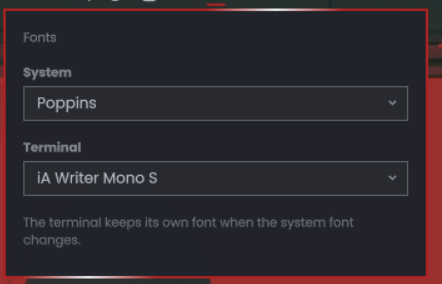

# Oma Dual Font

One font for the system, a different one for the terminal.



## Why

Omarchy has exactly one font. `omarchy-font-set` points the fontconfig
`monospace` alias at a family and rewrites every terminal config to match, so
the bar, Qt apps and the terminals all move together.

That is fine until you want something proportional on the desktop. I put
Poppins on mine, admired it for about four seconds, then opened a terminal and
watched my prompt turn into modern art. The font menu only lists monospace
families, which is Omarchy quietly protecting me from exactly this, and I went
around it anyway.

This plugin lets you have both. Pick any family for the system, keep a proper
monospace one in the terminal, and they stop fighting.

## How it works

Every terminal names its font family explicitly in its own config, so it
ignores the fontconfig alias entirely. That is the whole trick.

- The system font stays stock. Picking one just runs `omarchy-font-set`.
- The terminal font writes only the alacritty, kitty, ghostty and foot configs,
  and records the choice in `~/.config/omarchy/terminal-font`.
- A hook in `~/.config/omarchy/hooks/font-set.d/` replays that choice after any
  system font change, which is what stops one from dragging the other along.

With no terminal font pinned, every part of this is a no-op and Omarchy behaves
exactly as shipped. The hook installs itself the first time the widget loads.

The terminal list is monospace only, on purpose. I already know how that story
ends.

Both pickers also carry the six fonts Omarchy offers under Install > Style >
Font, even when they are not on the machine yet. They are marked as such, and
picking one opens the same floating terminal Omarchy uses to install a font,
then applies it. Showing fewer fonts than the stock menu offers felt like the
wrong kind of surprise.

## Install

```bash
git clone https://github.com/FromChaosComesClarity/oma-dual-font \
  ~/.config/omarchy/plugins/io.github.fromchaoscomesclarity.oma-dual-font
omarchy-shell shell rescanPlugins
```

Then add **Oma Dual Font** to the bar from the Omarchy menu, under
Style > Menu Bar, or drop it into `bar.layout` in
`~/.config/omarchy/shell.json`:

```json
{ "id": "io.github.fromchaoscomesclarity.oma-dual-font" }
```

Click the icon on the bar and both pickers are there. Both are searchable,
because the system list is every family fontconfig knows and that runs to a few
hundred on most machines.

## From a shell

The widget is a view over a CLI that works on its own:

```bash
bin/oma-dual-font doctor            # what is installed and what is set
bin/oma-dual-font terminal-options  # picker rows, installable fonts included
bin/oma-dual-font system-set Poppins
bin/oma-dual-font terminal-set 'iA Writer Mono S'
bin/oma-dual-font terminal-clear    # terminals follow the system font again
bin/oma-dual-font install-hook      # if you ever need to put the hook back
```

Ghostty and foot cannot reload a font in place, so you get a notification
asking you to restart them. foot's SIGUSR1 and SIGUSR2 switch colour theme
rather than reloading config, so there is no signal to send it. Alacritty and
kitty pick the change up immediately.

## Uninstall

```bash
bin/oma-dual-font terminal-clear
rm ~/.config/omarchy/hooks/font-set.d/10-oma-dual-font
rm -rf ~/.config/omarchy/plugins/io.github.fromchaoscomesclarity.oma-dual-font
```

Remove the widget from `bar.layout` and you are back to stock.

## What it touches

Worth being explicit, since this writes outside its own directory:

- `~/.config/alacritty/alacritty.toml`, `~/.config/kitty/kitty.conf`,
  `~/.config/ghostty/config` and `~/.config/foot/foot.ini`, but only the font
  family line, and only when you pick a terminal font.
- `~/.config/omarchy/terminal-font`, which is just the family name it remembers.
- `~/.config/omarchy/hooks/font-set.d/10-oma-dual-font`, installed the first
  time the widget loads. The name is plugin-specific so it cannot collide with
  anyone else's hook, and it is rewritten only when its contents would change.
- A marked block in `~/.config/fontconfig/fonts.conf`, between
  `<!-- oma-dual-font:begin -->` and `<!-- oma-dual-font:end -->`. Nothing
  outside those markers is touched, and `terminal-clear` removes the block.
  See below for why it has to be there.

The system font is never written directly. That is handed to `omarchy-font-set`.

### Why it touches fontconfig

`omarchy-font-set` writes a rule that prepends the system font to any pattern
mentioning `monospace`, with a strong binding. fontconfig tags every monospace
face with the generic `monospace` family, so that rule also catches a request
for a *named* monospace font. With a proportional system font set,
`fc-match "iA Writer Mono S"` answers Poppins.

Terminals that match families themselves, like kitty, never notice. Ones that
hand the name to fontconfig, like foot, get the system font instead of the
pinned one, which looks exactly like this plugin not working.

So the block puts the pinned family back in front when it was explicitly asked
for. A bare `monospace` request is untouched and still resolves to the system
font, which is what the bar and Qt apps ask for.

Nothing else is modified, and `terminal-clear` plus deleting that hook puts you
back to stock.

## Dependencies

Everything it needs ships with Omarchy already:

- `fontconfig` (`fc-list`, `fc-match`) for enumerating and resolving families
- `omarchy-font-set` for the system font
- `omarchy-pkg-add` and `omarchy-launch-floating-terminal-with-presentation`,
  used only when you pick one of the fonts Omarchy can install
- `omarchy-notification-send`, optional, for the restart nudge on ghostty and foot

No network access, no background daemon, and no other runtime.

## License

GPL-3.0-or-later.
